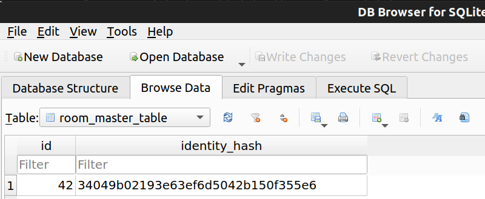
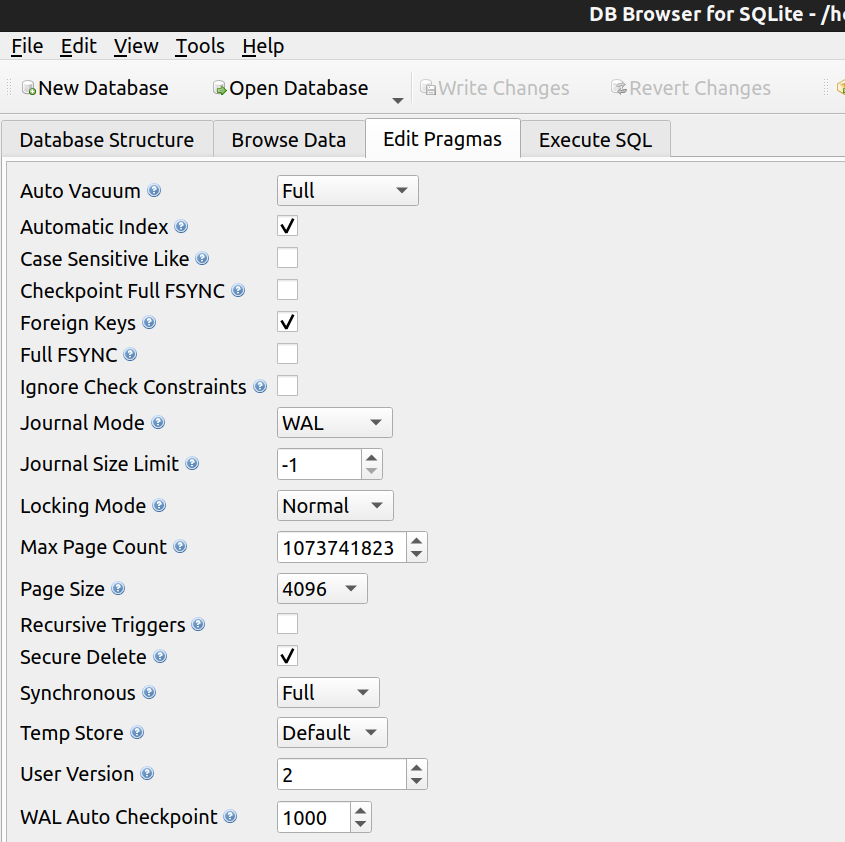

# Explore Dash Sync

## Build

### Recommended environments

Ubuntu 20.04.3 LTS or higher
  * Windows Subsystem for Linux
IntelliJ IDEA Community 2020.3 or higher

### Init

```
git clone https://github.com/dashpay/explore-dash-sync.git
cd explore-dash-sync
```

### Standalone app

#### Build

Generate executable [fat JAR](https://github.com/johnrengelman/shadow) `.\build\deploy\explore-dash-sync-app.jar`) which
can be launched locally

```
./gradlew buildApp
```

#### Run

```
java -jar .\build\deploy\explore-dash-sync-app.jar
```

This command will generate `explore.dat` file in the current directory Supported arguments:

- `-upload` - upload data to GC Storage
- `-dev` - load data from dev servers
- `-quiet` - quiet mode: no notifications are pushed to Slack

### Google Cloud Function

#### Build

Generate [fat JAR](https://github.com/johnrengelman/shadow) `.\build\deploy\explore-dash-sync-fun.jar` which can be
deployed to Google Cloud Platform ([BackgroundFunction](https://cloud.google.com/functions/docs/writing/background))

```
./gradlew buildFun
```

#### Deploy function to Google Cloud Platform

Base on [Deploying Cloud Functions](https://cloud.google.com/functions/docs/deploying)

```
gcloud functions deploy dash-explore-sync-dev \
 --runtime=java11 \
 --entry-point=org.dash.mobile.explore.sync.Function \
 --source=build/deploy \ 
 --trigger-topic dash-explore-sync-trigger \
 --allow-unauthenticated --memory=1024MB --timeout=300s
``` 

Can be deployed manually
from https://console.cloud.google.com/functions/list?authuser=0&project=dash-wallet-firebase `CREATE FUNCTION`

#### Trigger function

Function can be triggered by publishing `dash-explore-sync-trigger` PubSub topic

```
gcloud pubsub topics publish dash-explore-sync-trigger
```

### Generating Protocol Buffer messages (`javalite`)

- src: `./src/main/proto/`
- dst: `./src/main/java/`

```
./gradlew generateProto
```

# Google API credentials (credentials.json) not found.

Google Cloud Console -> (dash-explore-sync) -> Credentials -> Download OAuth client
https://console.cloud.google.com/apis/credentials?project=dash-explore-sync

save file as src/main/resources/credentials.json

# Editing the database
Suppose new columns need to be added to the explore database.
1. Use an SQLite DB Browser to edit the `merchant` or `atm` tables in `src/main/resources/explore-empty.db`
2. Add new columns as necessary
3. Add code in `MerchantData` or `AtmData` to support those new columns
4. Depending on the data source, code must be added the `convert` methods
5. Within `src/main/resources/explore-empty.db` edit the `room_master_table` table value for `identity_hash` must be updated to match that of the schema generated by Room in Dash Wallet
    ```json
    {
      "formatVersion": 1,
      "database": {
      "version": 2,
      "identityHash": "34049b02193e63ef6d5042b150f355e6",
      "entities": [
       
      ]
    }
    ```
   
6. Within `src/main/resources/explore-empty.db`, the User Version must be increased and match the version of `ExploreDatabase`
    ```kotlin
    @Database(entities = [
        Merchant::class,
        MerchantFTS::class,
        Atm::class,
        AtmFTS::class
    ], version = 2, exportSchema = true)
    @TypeConverters(RoomConverters::class)
    abstract class ExploreDatabase : RoomDatabase() {
    ```
    

Example of adding new columns to `MerchantData`:
```kotlin
data class MerchantData(
    // ...
    var minCardPurchase: Double? = 0.0,
    var maxCardPurchase: Double? = 0.0,
    
    // add new column variables here...
) {
    companion object {
        // Add a ? for each new column in this INSERT_STATEMENT constant  
        const val INSERT_STATEMENT = "INSERT INTO merchant values(?,?,?,?,?,?,?,?,?,?,?,?,?,?,?,?,?,?,?,?,?,?,?,?,?,?,?)"
        
        // ...
        const val MIN_CARD_PURCHASE_COL = 26
        const val MAX_CARD_PURCHASE_COL = 27

        // add new column number constance here...
    }

    override fun transferInto(statement: PreparedStatement): PreparedStatement {
        return statement.apply {
            // ...
            setDouble(MIN_CARD_PURCHASE_COL, minCardPurchase ?: 0.0)
            setDouble(MAX_CARD_PURCHASE_COL, maxCardPurchase ?: 0.0)

            // add new statements here to set the values of the new columns
        }
    }
}
```